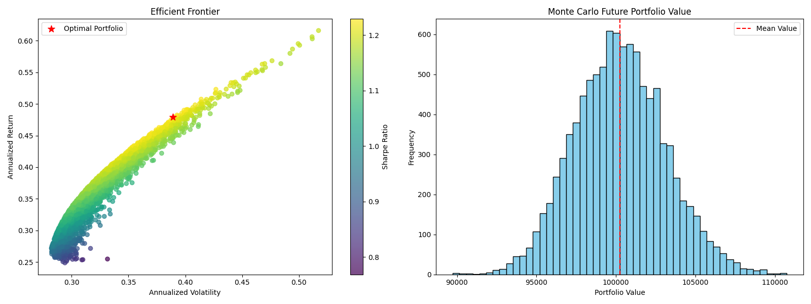

### Portfolio Optimization & Monte Carlo Simulation

This project uses **Modern Portfolio Theory** to construct an optimal stock portfolio by maximizing the **Sharpe Ratio**. It also performs a **Monte Carlo simulation** under a **Geometric Brownian Motion (GBM)** model to forecast future portfolio values and estimate risk over a 1-year horizon.

---

## Methodology

### Portfolio Optimization
- Pulled historical adjusted close prices using `yfinance`
- Computed annualized returns and covariances
- Used **SLSQP optimization** to maximize the Sharpe ratio
- Enforced constraints: weights must sum to 1, no short selling

### Monte Carlo Simulation
- Simulated 10,000 future price paths using GBM
- Calculated final portfolio values based on optimized weights
- Visualized the **probability distribution** of outcomes with key metrics like expected value and VaR

---

## Monte Carlo Forecast (10,000 Simulations)

```text
Initial Portfolio Value: $100,000.00
Expected Value (Mean): $101,821.73
5th Percentile (VaR 95): $94,124.16
95th Percentile: $109,803.41
```

---

## Optimal Portfolio Weights

```text
AAPL: 39.67%
MSFT: 0.00%
GOOG: 19.83%
AMZN: 0.00%
TSLA: 40.50%
```

> The optimizer concentrated weights in high Sharpe assets while assigning zero to others due to return/risk tradeoff.

---

## Visual Output



Left: Efficient Frontier with optimal Sharpe point (red star)  
Right: Monte Carlo simulation of 1-year portfolio value

---

## Project Structure

| File | Description |
|------|-------------|
| `portfolio_optimizer.py` | Main Python script |
| `README.md` | This project description |
| `output.png` | Visualization of results |
| `requirements.txt` | Python dependencies |

---

## How to Run

### 1. Install dependencies
```bash
pip install -r requirements.txt
```

### 2. Run the script
```bash
python portfolio_optimizer.py
```

---

## Features

- Efficient Frontier simulation (5,000 random portfolios)
- Sharpe-optimal weight calculation
- Monte Carlo simulation (10,000 paths) for forward-looking analysis
- Summary statistics: mean value, 5th/95th percentiles (VaR)
- Fully vectorized NumPy logic for performance

---

## Contact

Built by **Alay Patel**  
alaypatel02@gmail.com
[linkedin.com/in/alaypatel](https://linkedin.com/in/alaypatel02)
